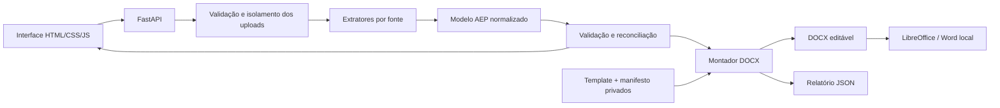
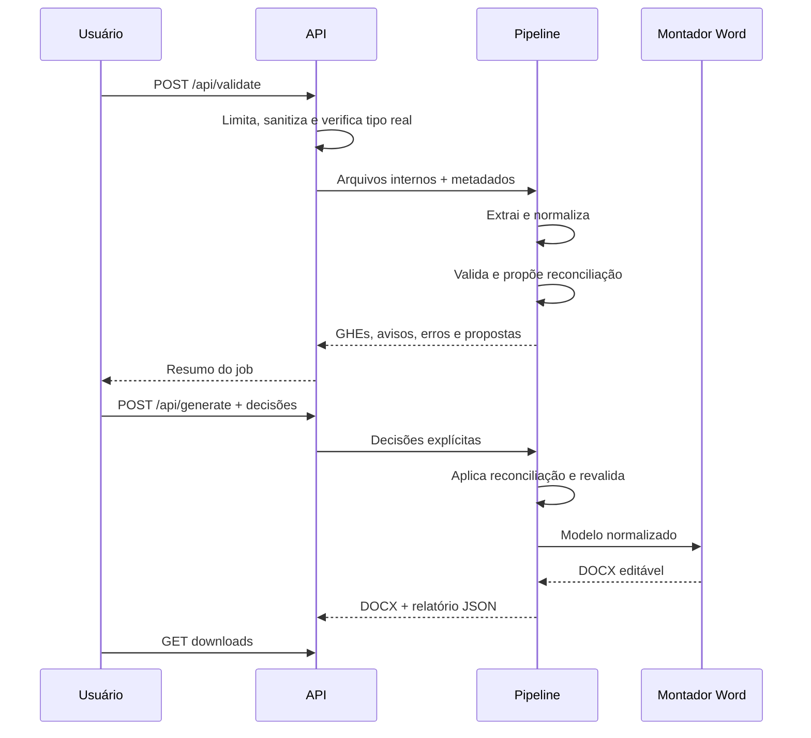

# Arquitetura

## Visão geral

O sistema é um monólito local em FastAPI. A interface envia arquivos por `multipart/form-data`; a camada HTTP os valida e os armazena em uma pasta aleatória da execução. A pipeline extrai cada fonte, cria um modelo normalizado, valida e reconcilia GHEs e, após confirmação do usuário, monta um DOCX sobre o template privado.

## Camadas

### HTTP e interface

- `app/main.py`: rotas, limites de requisição, validação inicial, estado dos jobs e downloads;
- `app/static/index.html`: formulário, revisão e área de resultado;
- `app/static/app.js`: seleção do modo técnico, envio, reconciliação, polling e downloads;
- `app/static/styles.css`: identidade e responsividade.

A API não recebe caminhos locais. Ela converte o nome do upload em um nome interno conhecido e associa o arquivo a um job de 32 caracteres hexadecimais.

### Domínio

`app/models/domain.py` contém modelos Pydantic para:

- empresa e dados do documento;
- GHEs oficiais e população;
- blocos do Ergo e seus elementos na ordem de origem;
- imagens e blocos psicossociais;
- seções técnicas aprovadas, priorizações, plano de ação e conclusão;
- propostas e decisões de reconciliação;
- avisos, erros e exceções de compatibilidade.

Caminhos e bytes de trabalho não fazem parte da exportação de auditoria. Nomes individuais provenientes da planilha são descartados antes da normalização. O modelo normalizado confidencial permanece temporariamente em memória entre validação e geração e é descartado após geração, falha ou expiração.

### Extração

- `ghe_extractor.py`: lê a planilha oficial e calcula população, setores e cargos;
- `ergo_extractor.py`: detecta HTML disfarçado de `.doc`, preserva a ordem visual e prepara conversão segura de OLE verdadeiro;
- `psico_extractor.py`: extrai imagens do pacote DOCX e as associa por títulos, GHE, dimensões e posição;
- `technical_report_extractor.py`: lê o relatório integrado ou combina os dois relatórios separados sem reescrever o conteúdo aprovado.

Cada extrator produz dados de domínio e metadados de proveniência. Não há inferência de novas conclusões.

### Normalização, validação e reconciliação

- `normalization.py`: padroniza espaços, códigos, datas e rótulos;
- `validation.py`: aplica regras de arquivo, completude, população, imagens e conteúdo obrigatório;
- `reconciliation.py`: compara blocos do Ergo com GHEs oficiais e registra a escolha explícita;
- `pipeline.py`: coordena as etapas e entrega contratos simples para a API.

A planilha é a fonte de verdade para identidade e população dos GHEs. Uma semelhança de nome pode gerar uma sugestão, nunca uma correção silenciosa. O usuário precisa aprovar um destino oficial ou marcar o bloco como não aplicável.

O modo de compatibilidade registra inclusões e omissões excepcionais com justificativa e aceite. Um perfil privado contém apenas os ordinais e uma impressão digital criptográfica das fontes esperadas; qualquer arquivo, modo de análise ou seleção diferente invalida o perfil. Essa decisão permanece no relatório de validação e não altera a regra geral.

### Montagem e renderização

- `document_assembler.py`: abre o template privado, preenche slots, substitui imagens, mantém estilos e cria o DOCX editável;
- `image_processing.py`: prepara imagens para os espaços do modelo sem distorcer proporções;
- `document_renderer.py`: converte `.doc` OLE sem shell, em perfil isolado e com macros desabilitadas, valida o resultado e renderiza por LibreOffice; no Windows pode usar Word como fallback;
- `scripts/prepare_private_template.py`: cria uma cópia saneada e parametrizada, além do manifesto, sem alterar o gabarito;
- `scripts/prepare_compatibility_profile.py`: cria um perfil privado vinculado ao conjunto exato de fontes de uma regressão excepcional;
- `scripts/compare_docx.py`: produz comparação estrutural e visual para regressão privada.

O saneador substitui conteúdo empresarial dinâmico por marcadores e imagens neutras e registra no manifesto hashes, digest dos marcadores, contrato de mídia, contagens e capacidade. O assembler habilita a atualização de campos do Word ao abrir e, antes de preencher, valida todo esse contrato. Slots não utilizados são limpos e nenhum marcador pode permanecer na saída. O arquivo de origem não é devolvido diretamente: campos, tabelas, textos e imagens são populados a partir do modelo normalizado da execução.

A capacidade faz parte do contrato, não de uma regra de negócio. O template privado atual possui três conjuntos de slots; um modelo com mais GHEs é rejeitado de forma explícita até que outro template declare capacidade suficiente.

## Fluxo de uma execução

Estados esperados do job:

1. `receiving`;
2. `validating`;
3. `validated` ou `needs_reconciliation`;
4. `generating`;
5. `completed`;
6. `validation_failed` ou `failed`, quando aplicável.

O servidor mantém metadados operacionais e, durante um job validado, o modelo normalizado em memória. Reiniciar o processo elimina esse estado. Após a geração ou uma falha, o modelo e os intermediários de conversão são descartados. Diretórios expirados são removidos com base no TTL configurado; a inicialização também procura órfãos com identificador válido e repete a remoção quando uma tentativa falha.

## Armazenamento local

| Área | Conteúdo | Política |
| --- | --- | --- |
| `uploads/<job-id>/` | entradas temporárias | isolada e expirada |
| `generated/` | trabalho intermediário | ignorada pelo Git |
| `outputs/` | documentos e comparações locais | ignorada pelo Git |
| `private_templates/` | template e manifesto | privada e ignorada |
| `local_samples/` | regressões confidenciais | privada e ignorada |
| `tests/fixtures/public_synthetic/` | fixtures sem validade | única exceção versionável |

## Controles de segurança

- limite individual e limite total de requisição;
- lista positiva de extensões por campo;
- inspeção profunda de assinatura, XML, relações e limites de expansão ZIP para DOCX/XLSX;
- detecção explícita de HTML compatível com Word e contêiner OLE;
- validação de assinatura para PNG, JPEG e WebP;
- nomes internos controlados pela aplicação;
- resolução e conferência de que todo caminho permanece sob o job;
- rejeição de macros, travessia ZIP e relações externas que não sejam hyperlinks;
- conversão OLE sem shell, em perfil LibreOffice exclusivo com macros desabilitadas;
- prontidão fechada quando o template saneado ou seu manifesto não passa na auditoria;
- mensagens públicas sem caminhos internos;
- logs restritos a identificador, estágio e classe de erro;
- respostas de download com `Cache-Control: no-store`.

O serviço escuta somente `127.0.0.1` por padrão. Como o MVP não autentica usuários, não deve ser exposto em rede sem uma camada externa apropriada.

## Configuração e dependências

`app/config.py` resolve caminhos relativamente à raiz do projeto e centraliza template, renderizador e retenção dos serviços. `app/main.py` aplica os limites da camada HTTP. O `iniciar.ps1` lê `.env`, preservando variáveis que já existiam no processo, e inicia Uvicorn.

As dependências principais são FastAPI, Pydantic, python-docx, lxml, BeautifulSoup, openpyxl e Pillow. LibreOffice e Poppler são ferramentas externas usadas para conversão e inspeção visual.

## Estratégia de testes

- unitários: detecção de tipo, normalização, planilha, HTML Ergo, DOCX técnico, imagens e reconciliação;
- integração: saúde, upload, validação, geração, download e limpeza;
- mutação: uma alteração sintética na fonte precisa aparecer na saída;
- regressão privada: comparação estrutural e visual entre referência aprovada e documento automático.

Todo teste versionado usa somente `tests/fixtures/public_synthetic/`. A regressão privada roda fora do histórico e seus artefatos ficam em `outputs/`.

## Pontos de extensão

- adaptadores de templates adicionais, cada um com seu próprio manifesto;
- exportação secundária para PDF;
- armazenamento persistente de jobs, se um produto multiusuário for criado;
- fila de processamento para documentos grandes;
- políticas adicionais de retenção e criptografia local.

Essas extensões não devem enfraquecer a rastreabilidade do conteúdo técnico nem a precedência da planilha oficial de GHEs.
