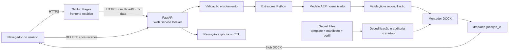
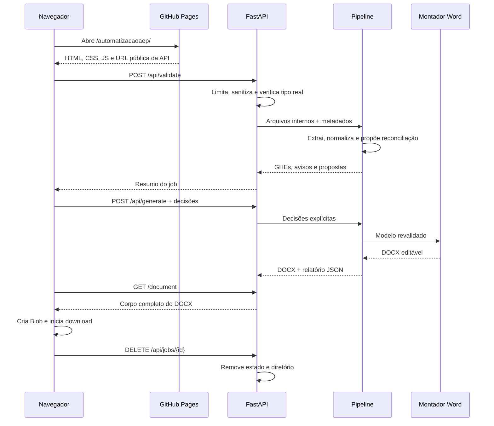

# Arquitetura

## Visão geral

O sistema separa a interface pública do processamento documental:



O frontend fica no GitHub Pages e contém apenas HTML, CSS, JavaScript e ativos públicos. O backend continua em Python/FastAPI, usa LibreOffice headless no container e processa os arquivos em armazenamento efêmero. Não há banco de dados, disco persistente ou sessão durável.

## Frontend estático

Arquivos:

- `frontend/index.html`: formulário, revisão, progresso, downloads e política de privacidade;
- `frontend/styles.css`: identidade visual e responsividade;
- `frontend/app.js`: uploads, validação, reconciliação, polling, download como `Blob` e exclusão;
- `frontend/config.js`: contrato público `window.AEP_CONFIG`;
- `frontend/assets/`: recursos públicos sem dados privados.

O workflow `.github/workflows/deploy-pages.yml` publica somente essa pasta. A URL da API é gerada no deploy a partir de:

```javascript
window.AEP_CONFIG = {
  API_BASE_URL: "https://origem-do-backend"
};
```

O valor vem da variável de repositório `AEP_API_BASE_URL`. Todas as referências do frontend são relativas para funcionar em `/automatizacaoaep/`. Uma URL vazia deixa a interface visível, mas desabilita o envio e não cria um backend fictício.

O frontend não contém Python, FastAPI, LibreOffice, template, credencial ou processamento documental. Ele orquestra o fluxo e exibe os dados retornados pela API.

## Backend FastAPI

### Camada HTTP

`app/main.py` concentra:

- rotas da API;
- limites de arquivo e requisição;
- nomes internos sanitizados;
- validação inicial;
- estado temporário dos jobs;
- CORS e verificação explícita de origem;
- cabeçalhos `Cache-Control: no-store`;
- download e limpeza;
- rotina periódica de expiração.

A API não recebe caminhos locais. Ela associa cada arquivo a um nome interno conhecido dentro do diretório aleatório do job.

Rotas:

| Método | Rota | Responsabilidade |
| --- | --- | --- |
| `GET` | `/api/health` | Liveness e prontidão da pipeline |
| `POST` | `/api/validate` | Upload, extração e validação |
| `POST` | `/api/generate` | Decisões de reconciliação e montagem |
| `GET` | `/api/jobs/{id}` | Progresso e estado |
| `GET` | `/api/jobs/{id}/document` | DOCX para o fluxo Blob + exclusão explícita |
| `GET` | `/api/jobs/{id}/validation-report` | Relatório JSON |
| `GET` | `/api/jobs/{id}/download` | DOCX com limpeza posterior à resposta |
| `DELETE` | `/api/jobs/{id}` | Remoção explícita |

### Domínio

`app/models/domain.py` define modelos Pydantic para:

- empresa e dados do documento;
- GHEs oficiais e população;
- blocos do Ergo e seus elementos na ordem de origem;
- imagens e blocos psicossociais;
- seções técnicas aprovadas, priorizações, plano de ação e conclusão;
- propostas e decisões de reconciliação;
- avisos, erros e exceções de compatibilidade.

Caminhos e bytes de trabalho não fazem parte da exportação de auditoria. Nomes individuais provenientes da planilha são descartados antes da normalização. O modelo normalizado permanece em memória apenas durante a vida do job.

### Extração

- `ghe_extractor.py`: lê a planilha oficial e calcula população, setores e cargos;
- `ergo_extractor.py`: detecta HTML com extensão `.doc`, preserva a ordem visual e prepara conversão segura de OLE verdadeiro;
- `psico_extractor.py`: extrai imagens do DOCX e as associa por títulos, GHE, dimensões e posição;
- `technical_report_extractor.py`: lê o relatório integrado ou combina dois relatórios separados sem reescrever o conteúdo aprovado.

Cada extrator produz dados de domínio e metadados de proveniência. Não há inferência de novas conclusões.

### Normalização, validação e reconciliação

- `normalization.py`: padroniza espaços, códigos, datas e rótulos;
- `validation.py`: aplica regras de arquivo, completude, população, imagens e conteúdo obrigatório;
- `reconciliation.py`: compara blocos do Ergo com GHEs oficiais e registra a escolha explícita;
- `pipeline.py`: coordena as etapas e entrega contratos para a API.

A planilha é a fonte de verdade para identidade e população dos GHEs. Semelhança de nome pode gerar sugestão, nunca correção silenciosa. O usuário aprova um destino oficial ou marca o bloco como não aplicável.

O modo de compatibilidade usa um perfil privado vinculado por hash às fontes esperadas. Qualquer alteração de arquivo, modo ou seleção invalida esse perfil.

### Montagem e renderização

- `document_assembler.py`: abre o template privado, preenche slots, substitui imagens, preserva estilos e cria o DOCX editável;
- `image_processing.py`: ajusta imagens sem distorcer proporções;
- `document_renderer.py`: converte `.doc` OLE em perfil isolado e renderiza com LibreOffice;
- `scripts/prepare_private_template.py`: cria o template saneado e seu manifesto;
- `scripts/prepare_hosted_template_secret.py`: valida e prepara os arquivos Base64 privados;
- `scripts/compare_docx.py`: produz comparação estrutural e visual para regressão privada.

O assembler habilita atualização de campos do Word ao abrir, valida o contrato de slots e recusa marcador residual ou capacidade insuficiente.

## Inicialização hospedada

O template não faz parte da imagem Docker. Três arquivos privados são montados pelo provedor:

```text
/etc/secrets/aep_template.docx.b64
/etc/secrets/aep_template.manifest.json.b64
/etc/secrets/aep_compatibility_profile.json.b64
```

No startup, `app/services/hosted_template.py`:

1. lê os arquivos pelos caminhos explicitamente configurados;
2. decodifica Base64 estrito;
3. grava o material em diretório temporário privado;
4. confere hashes, manifesto, estrutura e saneamento;
5. oferece os caminhos validados à pipeline;
6. mantém a pipeline indisponível se uma condição obrigatória falhar.

O conjunto Base64 privado medido ocupa 918.504 bytes. Ele permanece fora do Git, da imagem e do Pages.

## Fluxo de uma execução



Estados esperados:

1. `receiving`;
2. `validating`;
3. `validated` ou `needs_reconciliation`;
4. `generating`;
5. `completed`;
6. `validation_failed` ou `failed`.

O endpoint `/download` oferece uma alternativa com uma tarefa posterior à resposta. Ele não remove o documento antes de o envio terminar.

## Retenção e armazenamento

| Área | Conteúdo | Política |
| --- | --- | --- |
| `/tmp/aep-jobs/<job-id>/` | uploads, intermediários e resultados do job | temporária; DELETE ou TTL |
| `/tmp/aep-jobs/.hosted-template-*/` | template decodificado e validado | privada e temporária durante o processo |
| memória do processo | estado e modelo normalizado | perdida em reinício |
| `private_templates/` local | template, manifesto, perfil e Base64 | privada e ignorada |
| `tests/fixtures/public_synthetic/` | fixtures sem validade | única área documental versionável |

`AEP_JOB_TTL_SECONDS=900` define 15 minutos. A inicialização e uma rotina periódica tentam limpar jobs vencidos. O Render não recebe Persistent Disk e o serviço mantém uma única instância, pois não existe armazenamento compartilhado.

## Controles de segurança

- HTTPS no Pages e no endpoint público do Render;
- CORS por lista explícita, sem `*`;
- verificação de origem nas rotas operacionais;
- métodos e cabeçalhos limitados ao fluxo;
- limite individual e total de requisição;
- inspeção de assinatura, XML, relações e expansão ZIP;
- rejeição de macros, travessia ZIP e relações externas perigosas;
- validação de PNG, JPEG e WebP;
- nomes e caminhos controlados pela aplicação;
- identificadores imprevisíveis;
- conversão OLE sem shell e com perfil LibreOffice isolado;
- usuário não root no container;
- template privado validado no startup;
- mensagens públicas sem caminhos internos;
- logs sem conteúdo documental;
- respostas com `Cache-Control: no-store`;
- exclusão explícita e TTL.

CORS não é autenticação. Como o MVP não possui login, a arquitetura restringe o fluxo normal do navegador, mas não transforma a API em serviço privado.

## Container e infraestrutura

O `Dockerfile`:

- usa Python 3.12;
- instala LibreOffice Writer, Poppler e fontes;
- copia somente código e metadados necessários;
- cria diretórios temporários graváveis;
- executa como usuário não root;
- usa a variável `PORT`;
- inclui health check.

O `.dockerignore` impede a cópia de áreas privadas e documentos. O `render.yaml` define um Web Service Docker, uma instância, origem permitida, TTL e caminhos dos Secret Files, sem banco e sem disco persistente.

O CI executa testes Python, constrói a imagem, inspeciona a ausência de documentos privados e inicia o container para conferir prontidão, CORS, usuário e health check.

## Estratégia de testes

- unitários: configuração, tipo real, normalização, planilha, Ergo, DOCX, imagens, reconciliação, Base64 e TTL;
- integração: health, CORS, upload, validação, geração, download completo, exclusão e limpeza;
- frontend: configuração da API, caminhos relativos, subdiretório do Pages e ausência de secrets;
- container: build, usuário não root, filesystem temporário, health check e ausência de material privado;
- mutação: alteração sintética na fonte precisa aparecer na saída;
- regressão privada: comparação estrutural e visual entre referência aprovada e documento gerado.

Todo teste versionado usa fixtures sintéticas. A regressão privada e seus artefatos permanecem fora do histórico.

## Limitações e extensões futuras

- reiniciar ou implantar o serviço interrompe jobs ativos;
- uma única instância é necessária enquanto o estado permanecer em memória;
- o template declara uma capacidade de slots e entradas maiores são bloqueadas;
- o DOCX é a entrega principal; PDF permanece secundário;
- CORS não substitui autenticação;
- disponibilidade, logs de plataforma e descarte físico também dependem da configuração do provedor.

Possíveis extensões futuras incluem autenticação, fila distribuída e armazenamento temporário criptografado compartilhado. Elas exigem nova análise de privacidade e não devem enfraquecer a rastreabilidade do conteúdo técnico.
